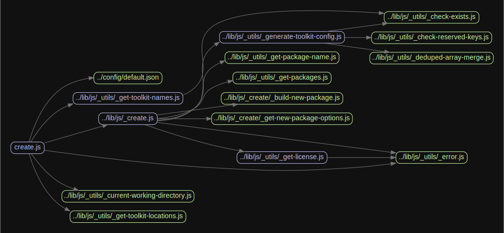
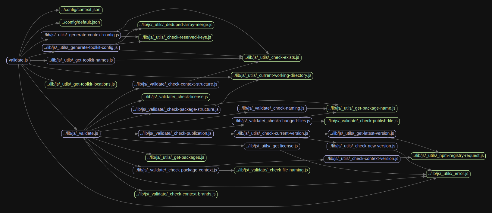
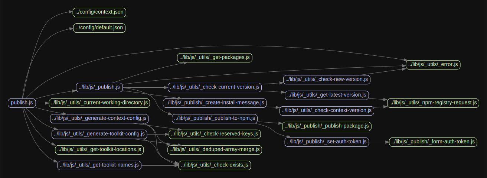

# Front-end package manager

[![NPM version][badge-npm]][info-npm]
[![Node version][badge-node]][info-node]
[![Build Status][badge-build]][info-build]
[![LGPL 3.0 licensed][badge-license]][info-license]

Handles the **creation**, **validation**, and **publication** of packages built as part of the Springer Nature Elements Design System. More information on how this is used can be found within the [developer documentation](https://github.com/springernature/frontend-elements-docs) for Elements.

The Design System is made up of different `toolkits` that contain `packages` designed for use with different `brands` within the Springer Nature ecosystem.

Packages are bundles of front-end assets (HTML, CSS, JS, images, tests etc...) that are published via NPM and used within the Springer Nature ecosystem. It is expected that multiple toolkits and packages live within one repository ([monorepo](https://medium.com/@maoberlehner/monorepos-in-the-wild-33c6eb246cb9)).

## Repository structure

The package manager expects the following repository structure:

```
repository-monorepo
  └── context
    └── name-of-context-package
  └── toolkits
    ├── name-of-toolkit
      └── packages
        ├── name-of-package
        └── name-of-other-package
    ├── name-of-toolkit
      └── packages
       └── name-of-package
    └── name-of-toolkit
      └── packages
       └── name-of-package
```

Where each individual toolkit (collection of packages) lives within a `toolkits` folder, and the packages within that toolkit live within a `packages` folder.

The package manager is used within the [Springer Nature Front-End Toolkits](https://github.com/springernature/frontend-toolkits) repository.

## Install

```
$ npm install --save-dev @springernature/frontend-package-manager
```

Installing `frontend-package-manager` adds [package management exectuables](#usage) to `./node_modules/.bin/`.

## Configuration

The package manager is configurable to enforce consistency across packages that are created. Below is the default configuration that is supplied:

### Default configuration

```json
{
  "scope": "springernature",
  "toolkitsDirectory": "toolkits",
  "packagesDirectory": "packages",
  "changelog": "HISTORY.md",
  "required": [
    "README.md",
    "package.json"
  ]
}
```

#### `scope`

Type: `String`

All packages must be published under an [organisation scope](https://docs.npmjs.com/misc/scope) on NPM. By default packages within the Springer Nature ecosystem are published to the company scope.

#### `toolkitsDirectory`

Type: `String`

Defines the parent folder under which toolkits live (see example structure above), and can **NOT** be changed.

#### `packagesDirectory`

Type: `String`

Defines the parent folder under which packages live within a specific toolkit (see example structure above), and can **NOT** be changed.

#### `changelog`

Type: `String`

All packages **MUST** have a changelog file in their root directory.

#### `required`

Type: `Array`

An array of top level files that **MUST** appear in any package. There is no need to specify the changelog file here, it is added automatically.

### Extending the default configuration

The default configuration options provided can be overriden and/or extended in one of two ways:

#### Repository

By providing a `package-manager.json` file at the root of the **`toolkits`** folder of your repository. Configuration options defined here will extend/override those in the default (with the exception of the `toolkitsDirectory` and `packagesDirectory` options), and are inherited by _all_ toolkits.

#### Toolkit

By providing a `package-manager.json` file in a specific toolkit folder e.g. `toolkits > name-of-toolkit`. Configuration options defined here will extend/override those at both the default and repository level (with the exception of the `toolkitsDirectory` and `packagesDirectory` options), and are used by just a single toolkit.

### Configuration options

The configuration files should take the same format as the default configuration, and can also add the following options:

#### `prefix`

Type: `String`

Package names can specify a prefix that namespaces them within NPM, based on which toolkit they live within.

For example all component packages published via the global toolkit use the prefix `global`, they will appear on NPM as `@springernature/global-name-of-component`

#### `folders`

Type: `Object`

A folders object can be added to the config. This contains keys that map to any folder names that are allowed within a package, with their value being an array of allowed file extensions within that folder.

If the `folders` key is present then these folders are the only ones allowed (but are optional). The folders can contain any number of sub-folders with no restriction on naming, but the file extensions within these sub-folders must match the array.

If the `folders` key is not present then any folders/files are allowed, with no restrictions.

The following example would allow a folder with the name `js` that contains files with the extensions `.js` and `.json`:

```json
"folders": {
  "js": [
    "js",
    "json"
  ]
}
```

#### `CSSDirectoryStructure`

Type: `Object`

This option allows you to specify a custom CSS folder structure. This is used in the [package creation](#package-creation) step to generate a sub-folder structure within a specified folder, to assist in quickly spinning up a new package. It is also used in the [validation](#package-validation) step to make sure that only valid CSS subdirectory naming is used.

The following shows an example folder structure, taken from the [Springer Nature Front-End Toolkits](https://github.com/springernature/frontend-toolkits) repository:

```json
"CSSDirectoryStructure": {
  "scss": [
    "10-settings",
    "20-functions",
    "30-mixins",
    "50-components"
  ]
}
```

In the above example, the object key `scss`, needs to match a key of the same name from the [folders](#folders) option mentioned above, to enable the sub-folders to be created in the correct parent.

#### `enforceBrandFileNaming`

Type: `Array`

This option accepts an array of folder paths that is used to enforce that all files contained in those folders are named after a valid brand (See the [context](#context) section below for more information on branding).

```json
"enforceBrandFileNaming": [
  "scss/10-settings"
]
```

If we have the brands `brandA` and `brandB` configured, then in the above example the only filenames allowed (where `ext` can be any file extension) within the `scss/10-settings` folder would be:
- `brandA.ext`
- `_brandA.ext`
- `brandB.ext`
- `_brandB.ext`

### Context

In addition to the `toolkits` folder there is also a `context` folder. This folder contains a single package that is split into `brands` and contains brand specific configurations and baseline styles that are used by other packages. The folder structure looks like this:

```
repository-monorepo
  └── context
    └── name-of-context-package
      ├── brand-name
      └── other-brand-name
```

The context package accepts the following default configuration which can be extended/overriden using a `package-manager.json` configuration within the `context` folder:

```json
{
  "scope": "springernature",
  "prefix": "brand",
  "contextDirectory": "context",
  "brandContextName": "brand-context",
  "brands": [],
  "changelog": "HISTORY.md",
  "required": [
    "README.md",
    "package.json"
  ]
}
```

In addition to the configuration options defined for regular packages, the context package allows an _additional_ `README.md` file within each brand folder e.g. `name-of-context-package/brand-name/README.md`, as well as the following additional configuration items:

#### `contextDirectory`

Type: `String`

Defines the parent folder under which the context package lives (see example structure above), and can **NOT** be changed.

#### `brandContextName`

Type: `String`

Defines the name of the context package, by default this is `brand-context`.

#### `brands`

Type: `Array`

Defines an array of brand names. These must map to the folder names that live within the context package. For example:

```json
{
  "brands": [
	"brandA",
	"brandB",
	"brandC"
  ]
}
```

## Package licensing

All packages that are published **MUST** be licensed. As packages are published as part of a monorepo the license file should live in the root of the repository, and be referenced in the `package.json`. If a `license` key is not found then no packages will be published.

## Usage

Four CLI scripts are provided as part of this package. They should all be run from your **repository root**, in the same location as your `package-manager.json` and `package.json` files.

| Script                                    | Description                               |
| ----------------------------------------- | ----------------------------------------- |
| `./node_modules/.bin/sn-package-create`   | Create boilerplate code for a new package |
| `./node_modules/.bin/sn-package-validate` | Validate toolkit packages against config  |
| `./node_modules/.bin/sn-package-publish`  | Publish a new/updated package             |
| `./node_modules/.bin/sn-package-demo`     | Compile demo code to static html          |

More guidance can be found within the tooling section of the [developer documentation](https://github.com/springernature/frontend-elements-docs/tree/master/tooling) for Elements.

## Continuous Integration

It is intended that the `validation` and `publication` scripts are run on your CI environment to ensure the safe and correct publication of packages.

When validating on your CI environment the `sn-package-validate` script should be run with the `-n` or `--npm` argument. This will validate for publication to NPM.

The `sn-package-publish` script expects a valid NPM token that allows you to publish to the specified organisation. this should be stored as an [Environment Variable](https://docs.travis-ci.com/user/environment-variables/#Defining-Variables-in-Repository-Settings) with the name `NPM_TOKEN`.

The script also expects the Environment Variable `CHANGED_FILES` which contains a list of all the files changed within the current commit, seperated with a line-break.

```yml
# Example from .travis.yml
env:
  global:
    - CHANGED_FILES=$(git diff --name-only $TRAVIS_COMMIT_RANGE)
```

Valid packages within the specified packages directory are identified, and a new version is published using the version number within the `package.json` file, if that version is greater than the last version published on NPM. Version numbers of `0.0.0` are ignored.

It is also required that the package `changelog` has been updated, and appears in the list of `CHANGED_FILES`, otherwise publication will not happen.

#### Travis

This package has been written to work with [TRAVIS CI](https://travis-ci.org/) and an example of the CI setup can be found in the Springer Nature [frontend-toolkits](https://github.com/springernature/frontend-toolkits):
- [`package.json`](https://github.com/springernature/frontend-toolkits/blob/master/package.json)
- [`package-manager.json`](https://github.com/springernature/frontend-toolkits/blob/master/toolkits/package-manager.json)
- [`.travis.yml`](https://github.com/springernature/frontend-toolkits/blob/master/.travis.yml)

## Testing

Unit tests for this package are written with [Jest](https://jestjs.io/en/). To run all the tests use `npm run test` from the command line.

## Linting

Javascript linting is enforced using the [Springer Nature Eslint config](https://www.npmjs.com/package/@springernature/eslint-config). Run the linter using `npm run lint` from the command line.

## Dependency graphs

Below are dependency graphs, generated using [Madge](https://www.npmjs.com/package/madge), for the three package manager entrypoints.

### create


### validate


### publish



## License

This repository is licensed under the [Lesser General Public License (LGPL-3.0)][info-license].
Copyright &copy; 2018, Springer Nature

[info-npm]: https://www.npmjs.com/package/@springernature/frontend-package-manager
[badge-npm]: https://img.shields.io/npm/v/@springernature/frontend-package-manager.svg
[info-license]: LICENSE
[badge-license]: https://img.shields.io/badge/license-LGPL%203.0-blue.svg
[info-build]: https://travis-ci.org/springernature/frontend-package-manager
[badge-build]: https://api.travis-ci.org/springernature/frontend-package-manager.svg?branch=master
[badge-node]: https://img.shields.io/badge/node->=8-brightgreen.svg
[info-node]: package.json
