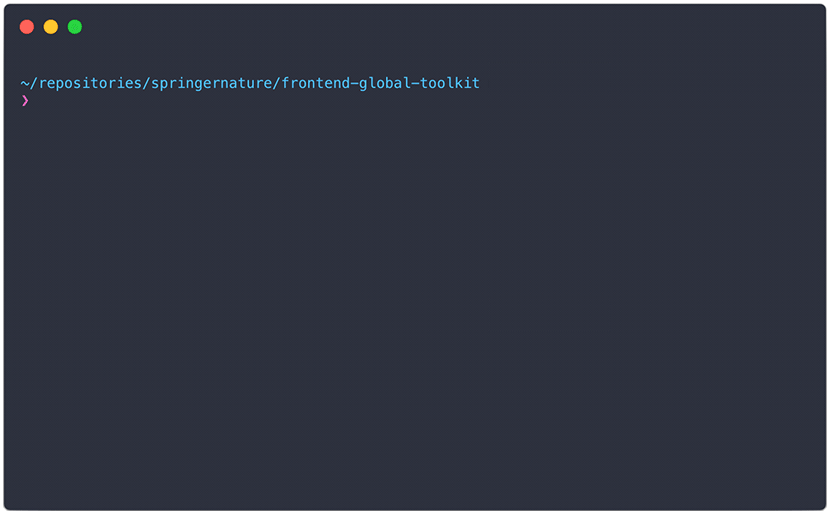

# Front-end Package manager


Handles the **creation**, **validation**, and **publication** of packages built as part of the Springer Nature Front-End Toolkits.

Packages are bundles of front-end assets (HTML, CSS, JS, Images) that are published via NPM and used within the Springer Nature ecosystem. It is expected that multiple packages live within one repository ([monorepo](https://medium.com/@maoberlehner/monorepos-in-the-wild-33c6eb246cb9)).

An example of this package in use can be found in the [Springer Nature Front-End Global Toolkit](https://github.com/springernature/frontend-global-toolkit)

## Install

```
$ npm install --save-dev @springernature/frontend-package-manager
```

Installing `frontend-package-manager` adds package management exectuables to `./node_modules/.bin/`.

## Configuration

The package manager is configurable to enforce consistency across packages that are created. Below is the default configuration that is supplied for Springer Nature toolkit packages.

### Default configuration

```json
{
  "scope": "springernature",
  "packagesDirectory": "./packages",
  "changelog": "HISTORY.md",
  "allowExtends": false,
  "required": [
    "README.md",
    "package.json"
  ]
}
```

#### scope
All packages must be published under an [organisation scope](https://docs.npmjs.com/misc/scope) on NPM. Packages within the Springer Nature ecosystem are published to the company scope and this **MUST NOT** be changed.

#### packagesDirectory
Packages should be self-contained units of code that all live within a specific directory within your repository.

#### changelog
All packages **MUST** have a changelog file in their root directory.

#### allowExtends
Can packages in this repository [extend other packages](#extending-other-packages)

#### required
An array of file paths that **MUST** appear in any package. There is no need to specify the changelog file here, it is added automatically.

### Extending the default configuration

You have the ability to override the default configuration, and extend it with a number of other options by providing a `package-manager.json` file in the root of your repository, in the same location as your `package.json` file. This user configuration file should take the same format as the default configuration, and can also add the following options:

#### prefix
Package names can specify a prefix that namespaces them within NPM based on where within the Springer Nature ecosystem they originate.

For example all Springer Nature packages published via the [frontend-global-toolkit](https://github.com/springernature/frontend-global-toolkit) use the prefix `global`, they will appear on NPM as `@springernature/global-name-of-component`

#### folders
A folders object can be added to the config. This contains keys that map to any folder names that are allowed within a package, with their value being an array of allowed file extensions within that folder.

If the `folders` key is present then these folders are the only ones allowed (but are optional). The folders can contain any number of sub-folders with no restriction on naming, but the file extensions within these sub-folders must match the array.

If the `folders` key is not present then any folders/files are allowed, with no restrictions.

The following example would allow a folder with the name `js` that contains files with the extensions `.js` and `.json`:

```json
"folders": {
  "js": [
    "js",
    "json"
  ]
}
```

## Package licensing

All packages that are published **MUST** be licensed. As packages are published as part of a monorepo the license file should live in the root of the repository, and be referenced in the `package.json`. If a `license` key is not found then no packages will be published.

## Usage

Three CLI scripts are provided as part of this package. They should all be run from your **repository root**, in the same location as your `package-manager.json` and `package.json` files.

### Package creation

The package creation script is a CLI based tool that can be used to quickly create a boilerplate new package based on the the configuration. This tool is designed to be run locally within your repository.

```
$ ./node_modules/.bin/sn-package-create
```



> Example from Springer Nature [Front-End Global Toolkit](https://github.com/springernature/frontend-global-toolkit)

### Package validation

The package validation script is a CLI based tool that will validate the packages against the configuration and provide output to the CLI. This can be run locally and as part of your CI environment.

Running this script will validate _all_ the packages in the provided packages directory:

```
$ ./node_modules/.bin/sn-package-validate
```

 Running with the `-p` or `--package` argument will validate the package named after the argument:

 ```
 $ ./node_modules/.bin/sn-package-validate -p name-of-package
 ```

 Running with the `-n` or `--npm` argument will validate for publication to NPM. This is designed to validate the [publication step on your CI environment](#package-publication) and should not be run locally:

 ```
 $ ./node_modules/.bin/sn-package-validate -n
 ```

 If you are running via [NPM Scripts](https://docs.npmjs.com/cli/run-script), remember to forward on your arguments using the format `npm run <command> [-- <args>]`. For example:

 ```
 $ npm run validate -- -p name-of-package
 ```

 To view all the options:

 ```
 $ ./node_modules/.bin/sn-package-validate -h
 ```

### Package publication

The package publication script is a CLI based tool that will publish new or updated packages to NPM. This is designed to [run on your CI environment](#continuous-integration) and should not be run locally.

```
$ ./node_modules/.bin/sn-package-publish
```

### Extending other packages

If the `allowExtends` option is set to `TRUE` then packages within the current repository can extend other (remote) packages _from the same [scope](#scope)_.

To extend another package, you need to define the package you wish to extend as a dependency within the `package.json` file of the local package. This should take the form `"extendsPackage": "name@version"`. In the following example we would extend version `1.0.0` of the package `left-pad` from NPM:

```json
{
  "extendsPackage": "left-pad@1.0.0"
}
```

Extending works by merging any files from the dependency package into the local package if they do not already exist. This process is designed to [run on your CI environment](#continuous-integration) during the publication stage. Take the following example file structures for a local package, and it's dependency:

```
local-package
  └── view
    └── file.html
  └── HISTORY.md
  └── package.json
  └── README.md

dependency-package
  └── scss
    └── file.scss
  └── js
    └── file.js
  └── HISTORY.md
  └── package.json
  └── README.md
```

In this case the folders `scss` and `js` are created within the local package, then the files `scss/file.scss` and `js/file.js` are copied from the dependency package to create the following file structure:

```
local-package
  └── scss
    └── file.scss
  └── js
    └── file.js
  └── view
    └── file.html
  └── HISTORY.md
  └── package.json
  └── README.md
```

#### validation

At the validation stage, if a package extends another package (the `extendsPackage` key exists), then validation passes if the `allowExtends` option is set to `TRUE`, and the correct version of the specified dependency exists on NPM.

#### publication

At the publication stage, an extended package will be published to NPM after the successfull completion of the following steps:

- A complete list of the files is retrieved from NPM for the dependency package, at the specified version
- For all files within the dependency package, if a file with the _same path_ is **not** found within the local package, then the file is copied from the dependency package to the local package

## Continuous Integration

It is intended that the validation and publication scripts are run on your CI environment to ensure the safe and correct publication of packages.

The `sn-package-publish` script expects a valid NPM token that allows you to publish to the specified organisation. this should be stored as an [Environment Variable](https://docs.travis-ci.com/user/environment-variables/#Defining-Variables-in-Repository-Settings) with the name `NPM_TOKEN`.

The script also expects the Environment Variable `CHANGED_FILES` which contains a list of all the files changed within the current commit, seperated with a line-break.

```yml
# Example from .travis.yml
env:
  global:
    - CHANGED_FILES=$(git diff --name-only $TRAVIS_COMMIT_RANGE)
```

Valid packages within the specified packages directory are identified, and a new version is published using the version number within the `package.json` file, if that version is greater than the last version published on NPM. Version numbers of `0.0.0` are ignored.

It is also required that the package `changelog` has been updated, and appears in the list of `CHANGED_FILES`, otherwise publication will not happen.

#### travis

This package has been written to work with [TRAVIS CI](https://travis-ci.org/) and an example of the CI setup can be found in the Springer Nature [frontend-global-toolkit](https://github.com/springernature/frontend-global-toolkit):
- [`package.json`](https://github.com/springernature/frontend-global-toolkit/blob/master/package.json)
- [`package-manager.json`](https://github.com/springernature/frontend-global-toolkit/blob/master/package-manager.json)
- [`.travis.yml`](https://github.com/springernature/frontend-global-toolkit/blob/master/.travis.yml)